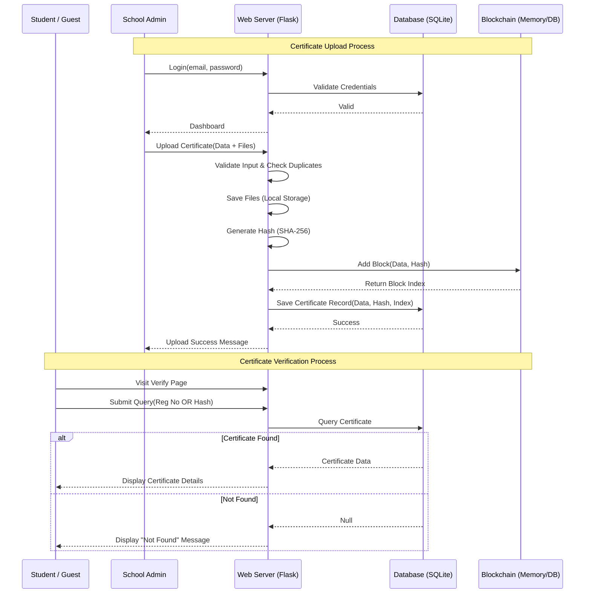

# Behavioral Diagrams

## Certificate Upload and Verification Flow (Sequence Diagram)

```mermaid
sequenceDiagram
    participant User as Student / Guest
    participant Admin as School Admin
    participant Server as Web Server (Flask)
    participant DB as Database (SQLite)
    participant BC as Blockchain (Memory/DB)

    Note over Admin, BC: Certificate Upload Process

    Admin->>Server: Login(email, password)
    Server->>DB: Validate Credentials
    DB-->>Server: Valid
    Server-->>Admin: Dashboard

    Admin->>Server: Upload Certificate(Data + Files)
    Server->>Server: Validate Input & Check Duplicates
    Server->>Server: Save Files (Local Storage)
    Server->>Server: Generate Hash (SHA-256)

    Server->>BC: Add Block(Data, Hash)
    BC-->>Server: Return Block Index

    Server->>DB: Save Certificate Record(Data, Hash, Index)
    DB-->>Server: Success
    Server-->>Admin: Upload Success Message

    Note over User, BC: Certificate Verification Process

    User->>Server: Visit Verify Page
    User->>Server: Submit Query(Reg No OR Hash)
    Server->>DB: Query Certificate

    alt Certificate Found
        DB-->>Server: Certificate Data
        Server-->>User: Display Certificate Details
    else Not Found
        DB-->>Server: Null
        Server-->>User: Display "Not Found" Message
    end
```
