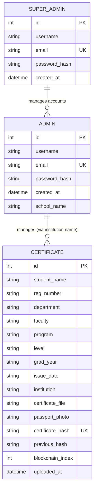

# Database Design

## Entity Relationship Diagram (ERD)

**Note:** The relationship between `ADMIN` and `CERTIFICATE` is logical, based on the `institution` field in `CERTIFICATE` matching the `school_name` field in `ADMIN`. There is no strict foreign key constraint in the current schema.
