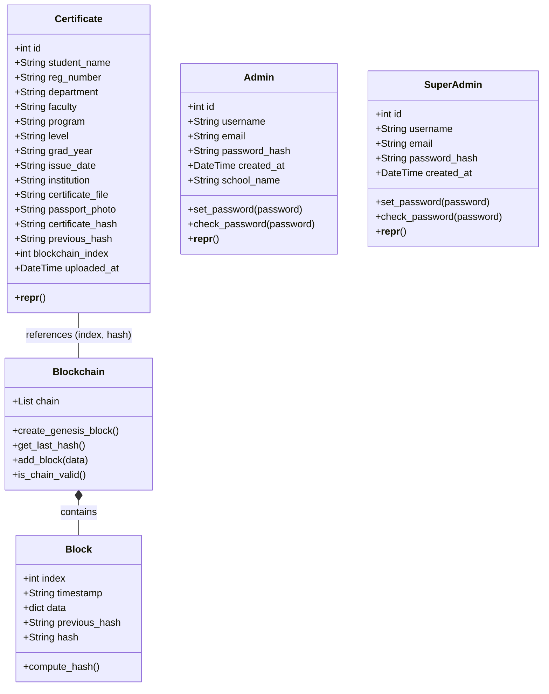

# Structural Diagrams

## Class Diagram

```mermaid
classDiagram
    class Certificate {
        +int id
        +String student_name
        +String reg_number
        +String department
        +String faculty
        +String program
        +String level
        +String grad_year
        +String issue_date
        +String institution
        +String certificate_file
        +String passport_photo
        +String certificate_hash
        +String previous_hash
        +int blockchain_index
        +DateTime uploaded_at
        +__repr__()
    }

    class Admin {
        +int id
        +String username
        +String email
        +String password_hash
        +DateTime created_at
        +String school_name
        +set_password(password)
        +check_password(password)
        +__repr__()
    }

    class SuperAdmin {
        +int id
        +String username
        +String email
        +String password_hash
        +DateTime created_at
        +set_password(password)
        +check_password(password)
        +__repr__()
    }

    class Blockchain {
        +List chain
        +create_genesis_block()
        +get_last_hash()
        +add_block(data)
        +is_chain_valid()
    }

    class Block {
        +int index
        +String timestamp
        +dict data
        +String previous_hash
        +String hash
        +compute_hash()
    }

    Blockchain *-- Block : contains
    Certificate -- Blockchain : references (index, hash)
```
